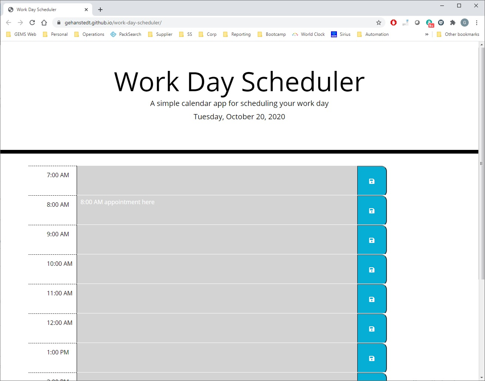

# Work Day Scheduler

G Dog's Work Day Scheduler

## Description
The Work Day Scheduler lets you schedule appointments in one hour increments 
throughout a day.    

## Requirements
* System displays a header containing the current date
* A time table to plan the day is displayed
    * Start and end are configurable by the constants in JavaScript
        * standardDayBegin
        * standardDayEnd
* The current hour is displayed in red.  Previous hours are in gray.  Future hours are in green.
* The user can click and enter text in the large field to the right of the hour.  After entering, the user can click the Save icon to save that hour's data to localStorage.
* When reloaded, the schedule will remember all values that were previously entered.

## Website
https://gehanstedt.github.io/work-day-scheduler/

## Screenshot

